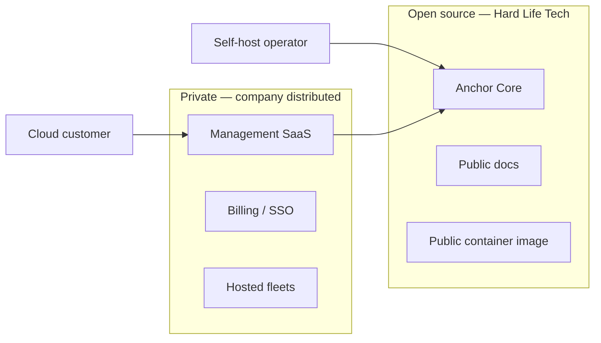

# Flow — OSS vs SaaS boundary

```mermaid
flowchart LR
  subgraph oss [Open source — Hard Life Tech]
    Core[Anchor Core]
    Docs[Public docs]
    Image[Public container image]
  end

  subgraph private [Private — company distributed]
    Mgmt[Management SaaS]
    Billing[Billing / SSO]
    Fleet[Hosted fleets]
  end

  Op1[Self-host operator] --> Core
  Op2[Cloud customer] --> Mgmt
  Mgmt --> Core
```

Core is sufficient alone. Management is optional and closed.
