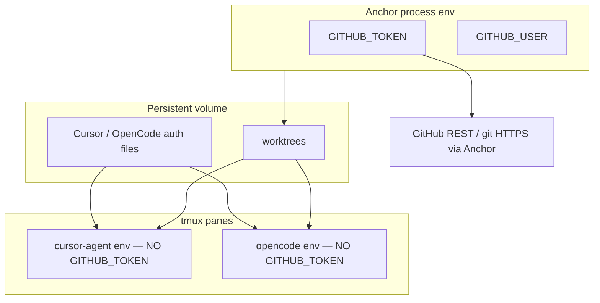

# Flow — secret isolation

```mermaid
flowchart TB
  subgraph anchor_proc [Anchor process env]
    T[GITHUB_TOKEN]
    U[GITHUB_USER]
  end

  subgraph disk [Persistent volume]
    WT[worktrees]
    AUTH[Cursor / OpenCode auth files]
  end

  subgraph tmux [tmux panes]
    P1[cursor-agent env — NO GITHUB_TOKEN]
    P2[opencode env — NO GITHUB_TOKEN]
  end

  T --> GH[GitHub REST / git HTTPS via Anchor]
  anchor_proc --> WT
  AUTH --> P1
  AUTH --> P2
  WT --> P1
  WT --> P2
```

**Rule:** `GITHUB_TOKEN` stays in Anchor **process** env only. Never `tmux setenv` it into panes. Never export it into agent attach sessions for convenience.
