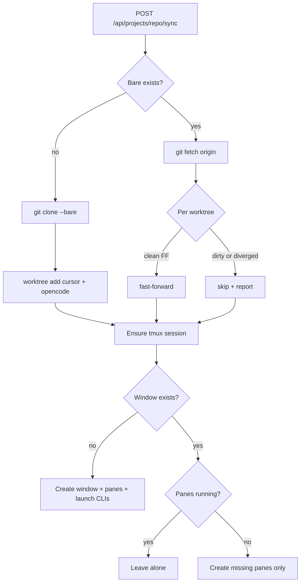

# Flow — sync and tmux

```mermaid
flowchart TD
  A[POST /api/projects/repo/sync] --> B{Bare exists?}
  B -->|no| C[git clone --bare]
  C --> D[worktree add cursor + opencode]
  B -->|yes| E[git fetch origin]
  E --> F{Per worktree}
  F -->|clean FF| G[fast-forward]
  F -->|dirty or diverged| H[skip + report]
  D --> I[Ensure tmux session]
  G --> I
  H --> I
  I --> J{Window exists?}
  J -->|no| K[Create window + panes + launch CLIs]
  J -->|yes| L{Panes running?}
  L -->|yes| M[Leave alone]
  L -->|no| N[Create missing panes only]
```
