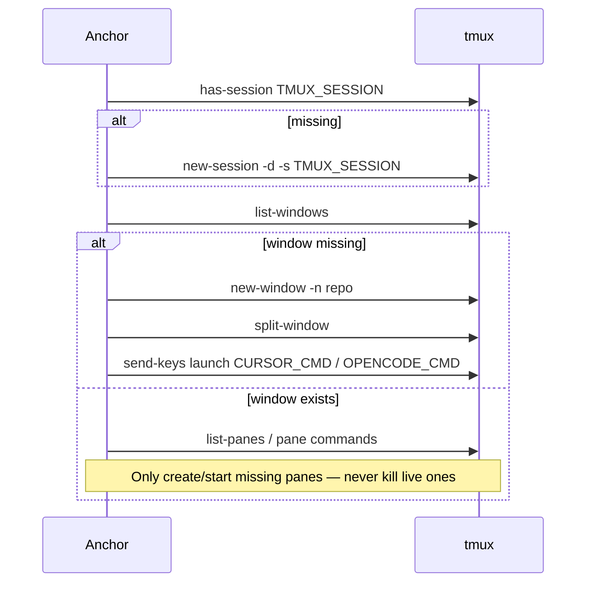

# Sequence — ensure tmux panes

```mermaid
sequenceDiagram
  participant API as Anchor
  participant Tmux as tmux

  API->>Tmux: has-session TMUX_SESSION
  alt missing
    API->>Tmux: new-session -d -s TMUX_SESSION
  end
  API->>Tmux: list-windows
  alt window missing
    API->>Tmux: new-window -n repo
    API->>Tmux: split-window
    API->>Tmux: send-keys launch CURSOR_CMD / OPENCODE_CMD
  else window exists
    API->>Tmux: list-panes / pane commands
    Note over API,Tmux: Only create/start missing panes — never kill live ones
  end
```
