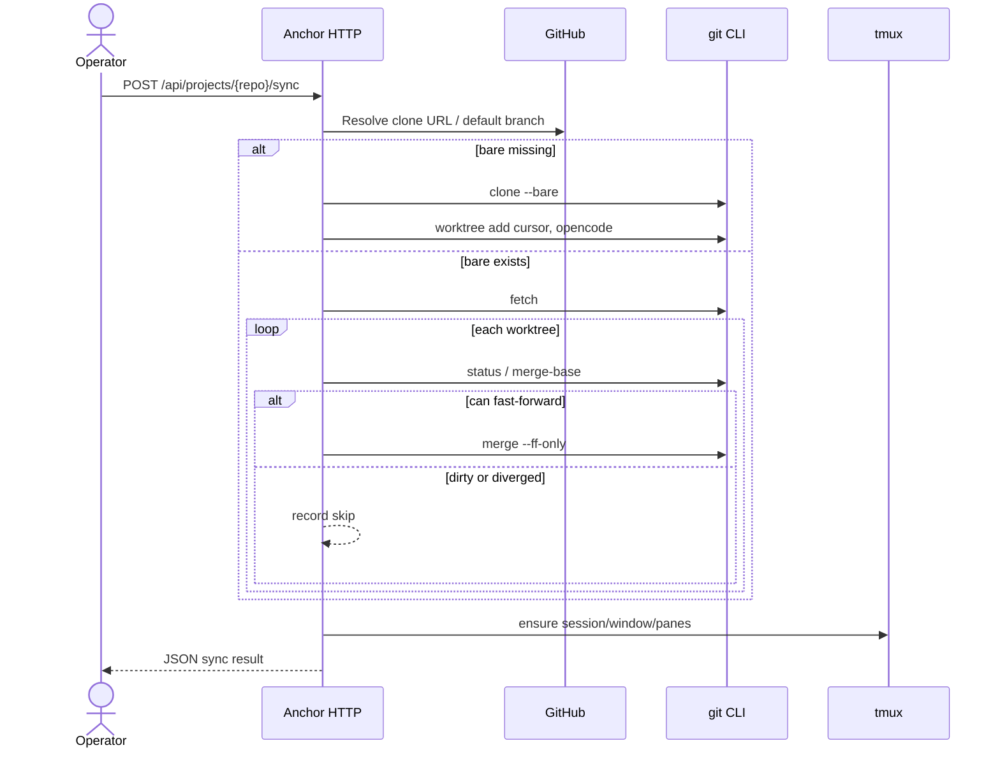

# Sequence — sync project

```mermaid
sequenceDiagram
  actor Op as Operator
  participant API as Anchor HTTP
  participant GH as GitHub
  participant Git as git CLI
  participant Tmux as tmux

  Op->>API: POST /api/projects/{repo}/sync
  API->>GH: Resolve clone URL / default branch
  alt bare missing
    API->>Git: clone --bare
    API->>Git: worktree add cursor, opencode
  else bare exists
    API->>Git: fetch
    loop each worktree
      API->>Git: status / merge-base
      alt can fast-forward
        API->>Git: merge --ff-only
      else dirty or diverged
        API-->>API: record skip
      end
    end
  end
  API->>Tmux: ensure session/window/panes
  API-->>Op: JSON sync result
```
