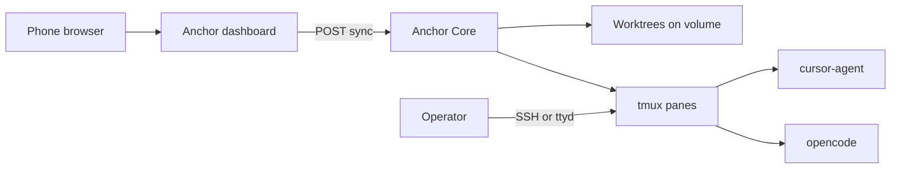

# Workflows

| Doc | Description |
|-----|-------------|
| [operator-day.md](operator-day.md) | Typical day: sync from phone, attach, prompt agents |
| [project-management.md](project-management.md) | GitHub Projects / Enterprise Projects usage for this repo |

## Operator flow (summary)

